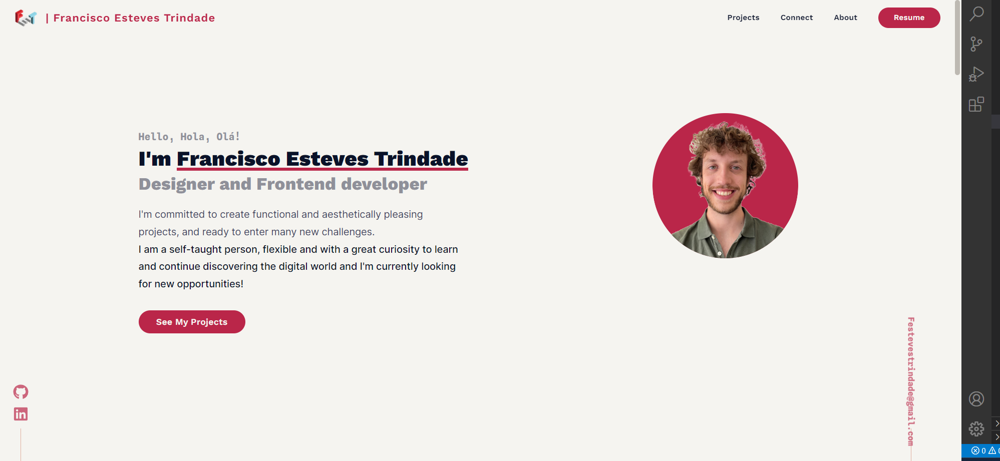

<div align="center">
  <a href="https://franestevestrindade.netlify.app/"></a>
</div>
<h1 align="center">
  fran.dev
</h1>
<p align="center">
  The first version of <a href="https://fran.dev/">fran.dev</a>, my portfolio. Built with <a href="https://vitejs.dev/">Vite</a> and Deployed by <a href="https://www.netlify.com/">Netlify</a>
</p>
<div align="center">
    
    
</div>

## Tools used 🧰

- [NodeJS](https://nodejs.org/)
- [Vite](https://vitejs.dev/)
- [React](https://reactjs.org/)
- [TypeScript](https://typescriptlang.org/)
- [react-spring](https://react-spring.dev/)
- [react-icons](https://react-icons.github.io/react-icons/)
- [react-helmet](https://www.npmjs.com/package/react-helmet)
- [@frank-mayer/react-tag-cloud](https://github.com/Frank-Mayer/react-tag-cloud)
- [PostCSS](https://postcss.org/)
- [Autoprefixer](https://autoprefixer.github.io/)
- [Figma](https://www.figma.com/)
- [Firefox](https://www.mozilla.org/en-US/firefox/)
- [Visual Studio Code](https://code.visualstudio.com/)

## Local development 🛠

1. Clone the project, then `cd` into it

```
git clone https://github.com/Festevestrindade/fran.dev && cd fran.dev
```

2. Install all the dependencies

```
yarn
```

3. Start the development server

```
yarn dev
```

<div align="center">
  <h3>Thank You! ❤</h3>
</div>
